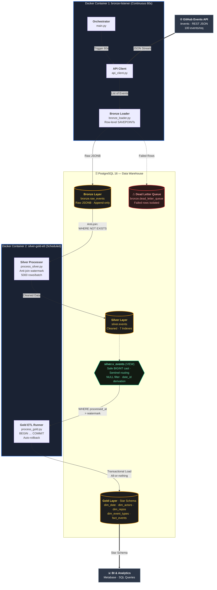
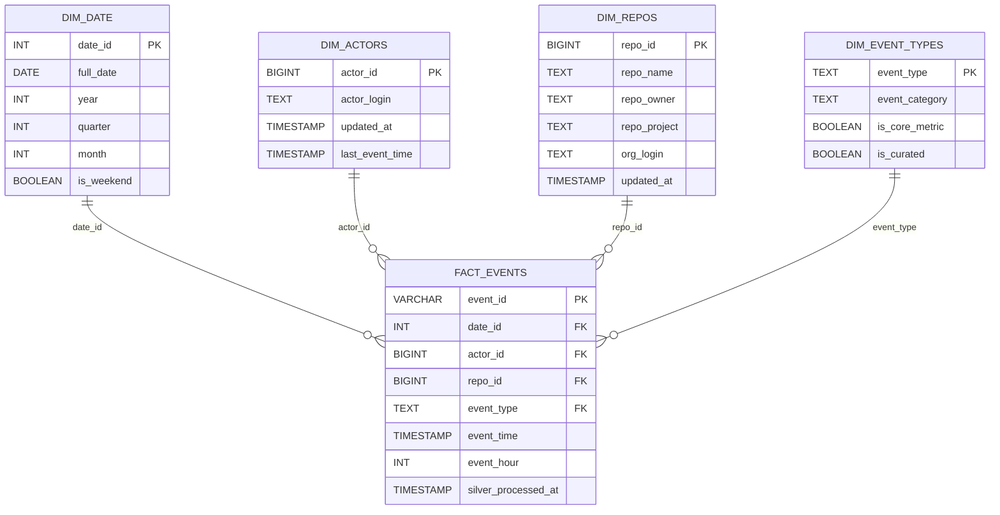

# GitHub Events Data Warehouse 🚀

> Production-style ETL pipeline ingesting GitHub's public events API into a dimensional data warehouse using **Medallion Architecture** (Bronze → Silver → Gold)

[](https://www.python.org/)
[](https://www.postgresql.org/)
[](https://www.docker.com/)
[](https://www.databricks.com/glossary/medallion-architecture)
[](./LICENSE)

---

## 📊 Project Overview

A robust, near real-time data pipeline that continuously ingests high-volume public GitHub events into a PostgreSQL Data Warehouse using the **Medallion Architecture** (Bronze → Silver → Gold).

All four layers are fully operational: **Ingestion**, **Bronze**, **Silver**, and **Gold**.

The pipeline runs as **two separate Dockerized processes** — a continuous Bronze ingestion listener and a scheduled Silver + Gold ETL transformer — reflecting how real production pipelines separate concerns between streaming ingestion and batch transformation.

---

## 🏗 Architecture

The pipeline uses a **Stateless Sliding Window** for ingestion and a **Watermark-based Incremental Batch** strategy for transformation.

### Medallion Pattern (Bronze → Silver → Gold)



### Data Flow

```
┌─────────────────────────────────────────────────────────────┐
│ BRONZE LAYER (Raw Storage)                                  │
├─────────────────────────────────────────────────────────────┤
│ • Continuous ingestion (every 60 seconds)                   │
│ • Raw JSONB storage (immutable audit trail)                 │
│ • Deduplication (ON CONFLICT DO NOTHING)                    │
│ • Row-level savepoints (failed rows go to DLQ, batch safe) │
│ • Dead Letter Queue (failed rows isolated, not lost)        │
└─────────────────────────────────────────────────────────────┘
                          ↓
┌─────────────────────────────────────────────────────────────┐
│ SILVER LAYER (Transformation)                               │
├─────────────────────────────────────────────────────────────┤
│ • Incremental batch processing (anti-join watermark)        │
│ • Type casting with sentinel values (-1, 'unknownuser')     │
│ • NULL event_time rows filtered before Gold exposure        │
│ • Watermark tracking (processed_at timestamp)               │
└─────────────────────────────────────────────────────────────┘
                          ↓
┌─────────────────────────────────────────────────────────────┐
│ GOLD LAYER (Star Schema)                                    │
├─────────────────────────────────────────────────────────────┤
│ • Kimball dimensional model (4 dimensions + 1 fact)         │
│ • Transactional loading (all-or-nothing, auto rollback)     │
│ • Late-arriving data protection (event_time ordering)       │
│ • Type 1 SCD (dimensions track current state)               │
│ • Auto-discovery pattern (unknown event types)              │
└─────────────────────────────────────────────────────────────┘
```

---

## ⭐ Key Features

### 1. Medallion Architecture
- ✅ **Bronze:** Immutable raw data lake (JSONB storage)
- ✅ **Silver:** Cleaned, validated, structured data
- ✅ **Gold:** Business-ready star schema for analytics

### 2. Industrial-Grade ETL Patterns
- ✅ **Watermark-based incremental loading** — processes only new data, scales to billions of rows
- ✅ **Transactional ETL** — all-or-nothing, automatic rollback on failure, watermark unchanged on error so next run auto-retries
- ✅ **Idempotent operations** — safe to re-run, no duplicates at any layer
- ✅ **Late-arriving data protection** — `ORDER BY event_time DESC` in dimension upserts prevents old data overwriting current values

### 3. Data Quality & Reliability
- ✅ **Row-level savepoints** — a single bad row rolls back only itself; the rest of the batch commits successfully
- ✅ **Dead Letter Queue** — failed rows are isolated and persisted, not silently dropped
- ✅ **Sentinel values** — `-1` actor/repo IDs map to `unknownuser`/`unknownrepo` dimension rows, satisfying FK constraints while keeping the pipeline running
- ✅ **Safe type casting** — regex validation (`^[0-9]+$`) before BIGINT conversion prevents silent corrupt data
- ✅ **NULL event_time filtering** — Silver view filters rows with unparseable timestamps before Gold ever sees them, preventing FK constraint crashes on the fact table

### 4. Schema Design
- ✅ **Kimball star schema** — 4 dimensions + 1 fact table
- ✅ **Smart date keys** — YYYYMMDD INT format for partition-friendly joins
- ✅ **Type 1 SCD with conditional update** — `WHERE dim_actors.last_event_time < EXCLUDED.last_event_time` ensures only fresher data updates the dimension, not all upserts blindly overwrite
- ✅ **Immutable facts** — historical events never change after Gold load
- ✅ **Auto-discovery** — new GitHub event types are automatically inserted into `dim_event_types` as uncurated rows, pipeline never crashes on unknown types

### 5. Operational Excellence
- ✅ **Dockerized** — two containers via Docker Compose, non-root user, secrets injected at runtime (never baked into image)
- ✅ **Graceful shutdown** — `SIGINT`/`SIGTERM` handlers finish the current batch before stopping
- ✅ **Dual logging** — structured logs per layer (console + file), `SILVER_DATA` logger file-only to avoid noise
- ✅ **Demo vs Production modes** — 2-minute cycles for portfolio demo, 2 AM daily for production
- ✅ **Performance timing** — per-step duration tracking via `CLOCK_TIMESTAMP()` in the Gold SQL script
- ✅ **One-command setup** — `python setup_db.py` initializes all schemas and layers in correct dependency order

---

## 📐 Gold Layer Schema

### Star Schema Design



### Dimensions
1. **dim_date** — Calendar dimension 2010–2028, pre-generated
2. **dim_actors** — GitHub users with Type 1 SCD and late-arriving data guard
3. **dim_repos** — Repositories with owner/project parsed from `owner/repo` name format
4. **dim_event_types** — Event taxonomy with auto-discovery and `is_curated` maintenance flag

### Fact Table
- **fact_events** — One row per GitHub event, FK-enforced references to all four dimensions

---

## 🛠️ Tech Stack

| Category | Technology |
|----------|------------|
| **Language** | Python 3.10+ |
| **Database** | PostgreSQL 16 |
| **Data Model** | Kimball Star Schema |
| **Architecture** | Medallion (Bronze / Silver / Gold) |
| **Containerization** | Docker + Docker Compose |
| **Libraries** | psycopg2, requests, python-dotenv |
| **Patterns** | Watermark incremental ETL, Type 1 SCD, Savepoint row isolation, Transactional ETL |

---

## 🚀 Quick Start

### 1. Prerequisites

- Python 3.10+
- PostgreSQL 16
- Docker + Docker Compose (optional, for containerized run)
- GitHub account (optional — unauthenticated limit is 60 req/hr, authenticated is 5,000)

### 2. Clone & Install

```bash
git clone https://github.com/yourusername/github-pipeline.git
cd github-pipeline
pip install -r requirements.txt
```

### 3. Configure Environment

Copy the example and fill in your values:

```bash
cp .env.example .env
```

```ini
# .env
DB_HOST=localhost
DB_NAME=github_events
DB_USER=postgres
DB_PASS=your_secure_password
DB_PORT=5432
GITHUB_TOKEN=ghp_your_token_here   # Optional but recommended
```

### 4. Initialize Database

One command sets up all schemas and layers in the correct order:

```bash
python setup_db.py
```

This runs Bronze DDL → Silver DDL → Silver View → Gold dimensions → Gold fact table, respecting FK dependency order.

### 5. Run the Pipeline

**Option A — Local (two terminals):**

```bash
# Terminal 1: Bronze ingestion (continuous, every 60s)
python ingestion/src/main.py
```

```bash
# Terminal 2: Silver + Gold ETL (scheduled)
python ingestion/src/process_etl.py
```

**Option B — Docker Compose (recommended):**

```bash
docker compose up --build
```

Both processes run as separate containers with shared log volume and secrets injected at runtime.

### Sample Output

```
# Bronze listener
2026-01-25 08:49:54 - ORCHESTRATOR - INFO - Pipeline started. Press Ctrl+C to stop.
2026-01-25 08:49:55 - API_CLIENT - INFO - Authenticated! Limit: 5000 (Remaining: 4987)
2026-01-25 08:49:55 - API_CLIENT - INFO - Successfully fetched 100 events.
2026-01-25 08:49:55 - BRONZE_LOADER - INFO - Batch Report: 95 Inserted | 5 Duplicates | 0 Errors
2026-01-25 08:49:55 - ORCHESTRATOR - INFO - Sleeping for 58 seconds...

# ETL scheduler
2026-01-25 08:50:00 - SILVER_GOLD_ETL_SCHEDULER - INFO - ETL RUN #1 - 08:50:00
2026-01-25 08:50:00 - SILVER_GOLD_ETL_SCHEDULER - INFO - [1/2] Silver Layer...
2026-01-25 08:50:01 - SILVER_JOB - INFO - Saved 95 events.
2026-01-25 08:50:01 - SILVER_JOB - INFO - Silver Layer is fully up to date.
2026-01-25 08:50:01 - SILVER_GOLD_ETL_SCHEDULER - INFO - Silver: Completed in 1.23s
2026-01-25 08:50:01 - SILVER_GOLD_ETL_SCHEDULER - INFO - [2/2] Gold Layer...
2026-01-25 08:50:02 - GOLD_ETL - INFO - [1/4] dim_actors: 87 rows | Duration: 45 ms
2026-01-25 08:50:02 - GOLD_ETL - INFO - [2/4] dim_repos: 92 rows | Duration: 38 ms
2026-01-25 08:50:02 - GOLD_ETL - INFO - [3/4] dim_event_types: 0 new types | Duration: 12 ms
2026-01-25 08:50:02 - GOLD_ETL - INFO - [4/4] fact_events: 95 rows | Duration: 67 ms
2026-01-25 08:50:02 - GOLD_ETL - INFO - COMMIT SUCCESSFUL: Gold Layer is up to date.
2026-01-25 08:50:02 - SILVER_GOLD_ETL_SCHEDULER - INFO - Gold: Completed in 1.56s
2026-01-25 08:50:02 - SILVER_GOLD_ETL_SCHEDULER - INFO - RUN #1 COMPLETE | Total Duration: 2.79s
```

---

## ⚙️ Configuration Modes

```python
# ingestion/src/process_etl.py
DEMO_MODE = True   # Every 2 minutes — for portfolio/demo
DEMO_MODE = False  # Daily at 2:00 AM — for production
```

---

## 📊 Sample Analytics Queries

### Q1: Daily Event Volume (Last 7 Days)

```sql
SELECT
    d.full_date,
    COUNT(*)                    AS total_events,
    COUNT(DISTINCT f.actor_id)  AS unique_users,
    COUNT(DISTINCT f.repo_id)   AS unique_repos
FROM gold.fact_events f
JOIN gold.dim_date d ON f.date_id = d.date_id
WHERE d.full_date >= CURRENT_DATE - 7
GROUP BY d.full_date
ORDER BY d.full_date;
```

### Q2: Top 10 Most Active Repositories (This Month)

```sql
SELECT
    r.repo_name,
    r.repo_owner,
    COUNT(*)                   AS total_events,
    COUNT(DISTINCT f.actor_id) AS contributors
FROM gold.fact_events f
JOIN gold.dim_repos r ON f.repo_id = r.repo_id
JOIN gold.dim_date d  ON f.date_id = d.date_id
WHERE d.year  = EXTRACT(YEAR  FROM CURRENT_DATE)
  AND d.month = EXTRACT(MONTH FROM CURRENT_DATE)
GROUP BY r.repo_name, r.repo_owner
ORDER BY total_events DESC
LIMIT 10;
```

### Q3: Hourly Activity Pattern (Weekday vs Weekend)

```sql
SELECT
    f.event_hour,
    d.is_weekend,
    COUNT(*) AS events
FROM gold.fact_events f
JOIN gold.dim_date d ON f.date_id = d.date_id
WHERE d.full_date >= CURRENT_DATE - 30
GROUP BY f.event_hour, d.is_weekend
ORDER BY d.is_weekend, f.event_hour;
```

### Q4: Auto-Discovered Event Types Pending Review

```sql
SELECT event_type, discovered_at
FROM gold.dim_event_types
WHERE is_curated = FALSE
ORDER BY discovered_at DESC;
```

---

## 📁 Project Structure

```
github-pipeline/
├── ingestion/
│   ├── src/
│   │   ├── main.py              # Bronze orchestrator (continuous loop)
│   │   ├── process_etl.py       # Silver + Gold scheduler
│   │   ├── process_silver.py    # Silver transformation logic
│   │   ├── process_gold.py      # Gold ETL runner (executes SQL script)
│   │   ├── api_client.py        # GitHub API client
│   │   ├── bronze_loader.py     # Bronze insert with savepoints + DLQ
│   │   ├── config.py            # Centralized config + validation
│   │   └── logger.py            # Dual-output logger factory
│   └── logs/
│       ├── pipeline.log
│       ├── bronze.log
│       ├── silver.log
│       └── silver_gold_etl.log
│
├── warehouse/
│   ├── bronze/
│   │   └── ddl.sql              # raw_events + dead_letter_queue
│   ├── silver/
│   │   ├── ddl.sql              # silver.events + 7 indexes
│   │   └── view_silver.sql      # Transformation view (type casting, sentinels, NULL filter)
│   └── gold/
│       ├── 01_dim_date.sql
│       ├── 02_dim_actors.sql
│       ├── 03_dim_repos.sql
│       ├── 04_dim_event_types.sql
│       ├── 05_fact_events.sql
│       └── etl/
│           └── master_gold_etl.sql   # Transactional ETL (BEGIN...COMMIT)
│
├── data_samples/
│   └── github_events_sample.json
├── Dockerfile
├── docker-compose.yml
├── setup_db.py                  # One-command full database initialization
├── .env.example
├── .gitignore
├── .dockerignore
├── requirements.txt
└── README.md
```

---

## 🎯 Design Decisions

### Why Two Separate Processes?
Bronze needs to run continuously to minimize data loss from GitHub's rolling event window. Silver + Gold are batch operations — running them on every Bronze insert would be wasteful and would complicate rollback boundaries. Separating them also means a Gold failure never takes down Bronze ingestion.

### Why Watermark Instead of Full Scans?
The anti-join pattern (`WHERE NOT EXISTS (SELECT 1 FROM silver.events s WHERE s.event_id = b.event_id)`) in Silver, and `WHERE processed_at > v_watermark` in Gold, means the pipeline only ever processes new data. Full table scans at scale would be untenable. This is the same pattern used in Snowflake, Databricks, and BigQuery incremental models.

### Why `ORDER BY event_time DESC` in Dimension Upserts?
When loading dimensions, `DISTINCT ON (actor_id) ... ORDER BY actor_id, event_time DESC` picks the most recent record per actor in a single pass. The conditional update `WHERE dim_actors.last_event_time < EXCLUDED.last_event_time` then ensures late-arriving old events cannot overwrite a dimension row that already has more current data.

### Why Transactional ETL with `BEGIN...COMMIT`?
If `dim_repos` loads successfully but `fact_events` fails, the whole transaction rolls back automatically. The watermark stays at the previous value, so the next scheduled run retries from exactly the right point. There are no partial states to clean up.

### Why Sentinel Values Instead of NULLs?
FK constraints on `fact_events` require every `actor_id` and `repo_id` to reference a real dimension row. NULLs would require nullable FKs, which weakens referential integrity. Sentinel rows (`-1, 'unknownuser'`) satisfy the constraint while flagging the bad data — the pipeline keeps running and the problem is visible in `fact_events WHERE actor_id = -1`.

### Why Savepoints Instead of Rollback in Bronze?
`conn.rollback()` rolls back the entire open transaction, not just the failed row. Using `SAVEPOINT` / `ROLLBACK TO SAVEPOINT` creates a named checkpoint inside the transaction so only the failing row is undone while all preceding successful inserts remain intact and committed.

---

## 🔍 Monitoring & Observability

### Log Files

```
ingestion/logs/
├── pipeline.log          # Orchestrator + Silver job summary
├── bronze.log            # Bronze insert reports
├── silver.log            # Silver row-level detail (file only, no console noise)
└── silver_gold_etl.log   # ETL scheduler run summaries
```

### Health Check Queries

```sql
-- How fresh is the Gold layer?
SELECT MAX(silver_processed_at) FROM gold.fact_events;

-- How many Bronze rows haven't been Silver-processed yet?
SELECT COUNT(*) FROM bronze.raw_events b
WHERE NOT EXISTS (SELECT 1 FROM silver.events s WHERE s.event_id = b.event_id);

-- How much bad data reached Gold via sentinel routing?
SELECT COUNT(*) AS unknown_actors FROM gold.fact_events WHERE actor_id = -1;
SELECT COUNT(*) AS unknown_repos  FROM gold.fact_events WHERE repo_id  = -1;

-- Any new event types waiting for manual curation?
SELECT event_type, discovered_at FROM gold.dim_event_types
WHERE is_curated = FALSE ORDER BY discovered_at DESC;
```

---

## 🚧 Roadmap

### Completed ✅
- [x] Bronze layer — raw JSONB storage + Dead Letter Queue + row-level savepoints
- [x] Silver layer — incremental transformation, type casting, NULL filtering
- [x] Gold layer — Kimball star schema with 4 dimensions + fact table
- [x] Watermark-based incremental loading
- [x] Transactional ETL (all-or-nothing with automatic rollback)
- [x] Late-arriving data protection on all dimension upserts
- [x] Auto-discovery of unknown event types
- [x] Dockerized deployment (two containers, non-root user)
- [x] Graceful shutdown on SIGINT/SIGTERM
- [x] One-command database setup

### Next Steps 🎯
- [ ] Apache Airflow orchestration (replace custom scheduler with DAGs)
- [ ] AWS deployment (EC2 + RDS + CloudWatch)
- [ ] Data quality test suite (pytest + scheduled checks)
- [ ] Dashboard / BI integration (Metabase or Tableau)
- [ ] CI/CD pipeline (GitHub Actions)

---

## 📚 Patterns & References

This project implements concepts from:

- **Kimball's Data Warehouse Toolkit** — dimensional modeling, star schema, Type 1 SCD
- **Databricks Medallion Architecture** — Bronze / Silver / Gold layering
- **Snowflake Best Practices** — watermark-based incremental loading
- **PostgreSQL Documentation** — savepoints, `DISTINCT ON`, conditional upserts, `RAISE NOTICE`

---

## 📝 License

MIT License — see [LICENSE](LICENSE) for details.

---

## 👤 Author

**Ragesh** — self-taught data engineer, second project.

---

⭐ If this project was useful or interesting, a star is appreciated!
