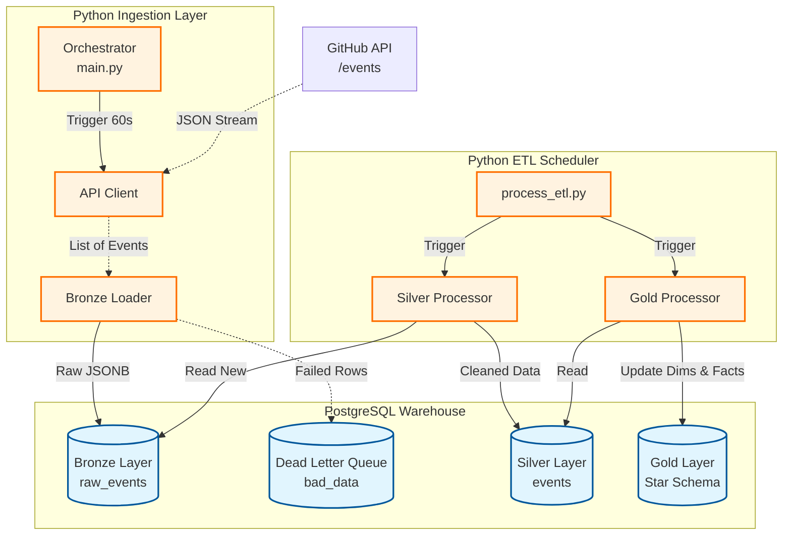
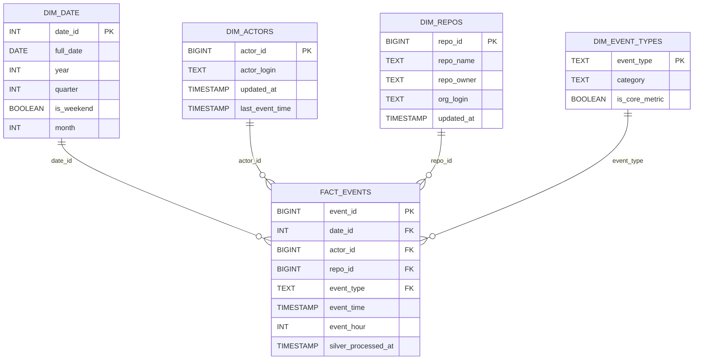

# GitHub Events Data Warehouse 🚀

> Production-ready ETL pipeline processing GitHub's public events API into a dimensional data warehouse using **Medallion Architecture** (Bronze → Silver → Gold)

[](https://www.python.org/)
[](https://www.postgresql.org/)
[](https://www.databricks.com/glossary/medallion-architecture)
[](./LICENSE)

---

## 📊 Project Overview


A robust, near real-time data pipeline that ingests high-volume public GitHub events into a PostgreSQL Data Warehouse using a **Medallion Architecture** (Bronze $\rightarrow$ Silver $\rightarrow$ Gold).

Currently, the **Ingestion Layer**, **Bronze Layer**, **Silver Layer**, and **Gold Layer** are fully operational.

## 🏗 Architecture

The pipeline uses a **Stateless Sliding Window** for ingestion and an **Incremental Batch** strategy for transformation.

### **Medallion Pattern (Bronze → Silver → Gold)**



### **Data Flow**

```
┌─────────────────────────────────────────────────────────────┐
│ BRONZE LAYER (Raw Storage)                                  │
├─────────────────────────────────────────────────────────────┤
│ • Continuous ingestion (every 60 seconds)                   │
│ • Raw JSONB storage (immutable audit trail)                 │
│ • Deduplication (ON CONFLICT DO NOTHING)                    │
│ • Dead Letter Queue (failed rows isolation)                 │
└─────────────────────────────────────────────────────────────┘
                          ↓
┌─────────────────────────────────────────────────────────────┐
│ SILVER LAYER (Transformation)                               │
├─────────────────────────────────────────────────────────────┤
│ • Incremental batch processing (anti-join pattern)          │
│ • Type casting with sentinel values (-1, 'unknownuser')     │
│ • Data validation & quality checks                          │
│ • Watermark tracking (processed_at timestamp)               │
└─────────────────────────────────────────────────────────────┘
                          ↓
┌─────────────────────────────────────────────────────────────┐
│ GOLD LAYER (Star Schema)                                    │
├─────────────────────────────────────────────────────────────┤
│ • Kimball dimensional model (4 dimensions + 1 fact)         │
│ • Transactional loading (BEGIN...COMMIT)                    │
│ • Late-arriving data protection (event_time ordering)       │
│ • Type 1 SCD (slowly changing dimensions)                   │
│ • Auto-discovery pattern (unknown event types)              │
└─────────────────────────────────────────────────────────────┘
```

---

## ⭐ Key Features

### **1. Medallion Architecture**
- ✅ **Bronze:** Immutable raw data lake (JSONB storage)
- ✅ **Silver:** Cleaned, validated, structured data
- ✅ **Gold:** Business-ready star schema for analytics

### **2. Industrial-Grade ETL Patterns**
- ✅ **Watermark-based incremental loading** (processes only new data)
- ✅ **Transactional ETL** (all-or-nothing, automatic rollback on failure)
- ✅ **Idempotent operations** (safe to re-run, no duplicates)
- ✅ **Late-arriving data handling** (ORDER BY event_time prevents overwrites)

### **3. Data Quality & Reliability**
- ✅ **Dead Letter Queue** (failed rows don't crash pipeline)
- ✅ **Sentinel values** (-1 for invalid IDs, 'unknownuser' for missing data)
- ✅ **Safe type casting** (regex validation before BIGINT conversion)
- ✅ **FK constraint enforcement** (fail-fast vs silent data loss)

### **4. Operational Excellence**
- ✅ **Dual logging** (console + file-based logs per layer)
- ✅ **Graceful shutdown** (Ctrl+C finishes current batch)
- ✅ **Demo vs Production modes** (2-min cycles vs daily 2 AM runs)
- ✅ **Performance timing** (per-step duration tracking)

### **5. Schema Design**
- ✅ **Star schema** (Kimball methodology)
- ✅ **Smart date keys** (YYYYMMDD INT format for performance)
- ✅ **Type 1 SCD** (dimensions track current state)
- ✅ **Immutable facts** (historical events never change)

---

## 📐 Gold Layer Schema

### **Star Schema Design**



### **Dimensions**
1. **dim_date**  - Calendar dimension 2020-2030
2. **dim_actors**  - GitHub users
3. **dim_repos**  - Repositories
4. **dim_event_types**  - Event taxonomy with auto-discovery

### **Fact Table**
- **fact_events**  - GitHub events with FK references

---

## 🛠️ Tech Stack

| Category | Technology |
|----------|-----------|
| **Language** | Python 3.10+ |
| **Database** | PostgreSQL 16 |
| **Data Model** | Kimball Star Schema |
| **Architecture** | Medallion (Bronze/Silver/Gold) |
| **Libraries** | psycopg2, requests, python-dotenv |
| **Patterns** | Watermark-based incremental ETL, Type 1 SCD |

---

## 🚀 Quick Start

### **1. Prerequisites**

- Python 3.10+
- PostgreSQL 16
- GitHub account (optional, for higher API limits)

### **2. Installation**

```bash
# Clone repository
git clone https://github.com/yourusername/github-pipeline.git
cd github-pipeline

# Install dependencies
pip install -r requirements.txt
```

### **3. Configuration**

Create `.env` file in project root:

```ini
DB_HOST=localhost
DB_NAME=github_events
DB_USER=postgres
DB_PASS=your_secure_password
DB_PORT=5432
GITHUB_TOKEN=ghp_your_token_here  # Optional (5000 req/hr vs 60)
```

### **4. Database Initialization**

```bash
# Create schemas (Bronze, Silver, Gold)
python setup_db.py

# Create Gold star schema
psql -U postgres -d github_events -f warehouse/gold/01_dim_date.sql
psql -U postgres -d github_events -f warehouse/gold/02_dim_actors.sql
psql -U postgres -d github_events -f warehouse/gold/03_dim_repos.sql
psql -U postgres -d github_events -f warehouse/gold/04_dim_event_types.sql
psql -U postgres -d github_events -f warehouse/gold/05_fact_events.sql

# Create Silver view
psql -U postgres -d github_events -f warehouse/silver/view_silver.sql
```

### **5. Run Pipeline**

**Two separate processes:**

**Terminal 1: Bronze Ingestion (Continuous)**
```bash
python ingestion/src/main.py

# Output:
# 🔵 BRONZE LAYER - CONTINUOUS INGESTION
# Schedule: Every 60 seconds
# ✅ Ingested 95 events in 1.23s
# 💤 Next poll in 58 seconds...
```

**Terminal 2: Silver + Gold ETL (Scheduled)**
```bash
python ingestion/src/process_etl.py

# Output:
# ⚪🟡 SILVER + GOLD ETL SCHEDULER
# Mode: DEMO (2-min cycles)
# [1/2] Silver Layer: Transforming Bronze → Silver...
# ✅ Silver: Completed in 2.34s
# [2/2] Gold Layer: Loading Star Schema...
# ✅ Gold: Completed in 1.56s
```

---

## ⚙️ Configuration Modes

### **Demo Mode (Default)** - For Testing/Portfolio
```python
# ingestion/src/process_etl.py
DEMO_MODE = True  # Runs every 2 minutes
```

### **Production Mode** - For Real Deployment
```python
# ingestion/src/process_etl.py
DEMO_MODE = False  # Runs daily at 2:00 AM
```

---

## 📊 Sample Analytics Queries

### **Q1: Daily Event Volume (Last 7 Days)**
```sql
SELECT 
    d.full_date,
    COUNT(*) as total_events,
    COUNT(DISTINCT f.actor_id) as unique_users,
    COUNT(DISTINCT f.repo_id) as unique_repos
FROM gold.fact_events f
JOIN gold.dim_date d ON f.date_id = d.date_id
WHERE d.full_date >= CURRENT_DATE - 7
GROUP BY d.full_date
ORDER BY d.full_date;
```

### **Q2: Top 10 Most Active Repositories (This Month)**
```sql
SELECT 
    r.repo_name,
    r.repo_owner,
    COUNT(*) as total_events,
    COUNT(DISTINCT f.actor_id) as contributors
FROM gold.fact_events f
JOIN gold.dim_repos r ON f.repo_id = r.repo_id
JOIN gold.dim_date d ON f.date_id = d.date_id
WHERE d.year = EXTRACT(YEAR FROM CURRENT_DATE)
  AND d.month = EXTRACT(MONTH FROM CURRENT_DATE)
GROUP BY r.repo_name, r.repo_owner
ORDER BY total_events DESC
LIMIT 10;
```

### **Q3: Hourly Activity Pattern (Weekday vs Weekend)**
```sql
SELECT 
    f.event_hour,
    d.is_weekend,
    COUNT(*) as events
FROM gold.fact_events f
JOIN gold.dim_date d ON f.date_id = d.date_id
WHERE d.full_date >= CURRENT_DATE - 30
GROUP BY f.event_hour, d.is_weekend
ORDER BY d.is_weekend, f.event_hour;
```

---

## 📁 Project Structure

```
github-pipeline/
├── ingestion/
│   ├── src/
│   │   ├── main.py
│   │   ├── process_etl.py
│   │   ├── process_silver.py
│   │   ├── process_gold.py
│   │   ├── api_client.py
│   │   ├── bronze_loader.py
│   │   ├── config.py
│   │   └── logger.py
│   └── logs/
│
├── warehouse/
│   ├── bronze/
│   │   └── ddl.sql
│   ├── silver/
│   │   ├── ddl.sql
│   │   └── view_silver.sql
│   └── gold/
│       ├── 01_dim_date.sql
│       ├── 02_dim_actors.sql
│       ├── 03_dim_repos.sql
│       ├── 04_dim_event_types.sql
│       ├── 05_fact_events.sql
│       └── etl/
│           └── master_gold_etl.sql
│
├── data_samples/
│   └── github_events_sample.json
├── .env.example
├── .gitignore
├── requirements.txt
├── setup_db.py
├── LICENSE
└── README.md
```

---

## 🎯 Design Decisions & Learnings

### **1. Why Two Separate Processes?**
- **Bronze (continuous):** Captures events in real-time, minimizes data loss
- **Silver + Gold (scheduled):** Batch processing is more efficient than row-by-row

### **2. Why Watermark Instead of Full Scans?**
- Processes only new data (99% faster for incremental loads)
- Scales to billions of rows
- Industry standard (Snowflake, Databricks, BigQuery)

### **3. Why ORDER BY event_time Instead of processed_at?**
- Prevents late-arriving old data from overwriting current data
- Example: Event from yesterday arrives today → Should not overwrite current dimension values

### **4. Why Transactional ETL (BEGIN...COMMIT)?**
- All-or-nothing: If Gold fails, dimensions roll back automatically
- No partial failures, no silent data loss
- Watermark unchanged on failure → Auto-retry next run

### **5. Why Sentinel Values Instead of NULLs?**
- FK constraints require valid references
- -1 actor_id → "unknownuser" dimension row
- Enables pipeline to continue vs crashing on bad data

---

## 📈 Performance Metrics

| Metric | Value |
|--------|-------|
| **Bronze ingestion** | ~100 events/minute |
| **Silver batch size** | 5,000 rows |
| **Gold ETL duration** | ~3 seconds (1,000 events) |
| **Storage** | ~500 MB per 1M events (JSONB) |
| **Indexes** | 7 (Silver), 9 (Gold) for query performance |

---

## 🔍 Monitoring & Observability

### **Log Files**
```
ingestion/logs/
├── pipeline.log
├── bronze.log
├── silver.log
└── silver_gold_etl.log
```

### **Health Checks**
```sql
SELECT MAX(silver_processed_at) FROM gold.fact_events;

SELECT COUNT(*) FROM bronze.raw_events b
WHERE NOT EXISTS (SELECT 1 FROM silver.events s WHERE s.event_id = b.event_id);

SELECT COUNT(*) FROM gold.fact_events WHERE actor_id = -1;
SELECT COUNT(*) FROM gold.fact_events WHERE repo_id = -1;
```

---

## 🚧 Roadmap

### **Completed ✅**
- [x] Bronze layer (raw JSONB storage + DLQ)
- [x] Silver layer (incremental transformations)
- [x] Gold layer (star schema with 4 dimensions)
- [x] Watermark-based incremental loading
- [x] Transactional ETL (all-or-nothing)
- [x] Late-arriving data protection
- [x] Demo vs Production modes

### **Next Steps 🎯**
- [ ] Apache Airflow orchestration (DAGs for scheduling)
- [ ] AWS deployment (EC2 + RDS)
- [ ] Data quality tests (Great Expectations)
- [ ] Dashboard/BI integration (Metabase/Tableau)
- [ ] CI/CD pipeline (GitHub Actions)

---

## 📚 Learning Resources

This project implements patterns from:
- **Kimball's Data Warehouse Toolkit** (dimensional modeling)
- **Databricks Medallion Architecture** (Bronze/Silver/Gold)
- **Snowflake Best Practices** (watermark-based loading)
- **Enterprise ETL Patterns** (transactional, idempotent operations)

---

## 📝 License

MIT License - see [LICENSE](LICENSE) file for details

---

## 👤 Author

**Ragesh**

---

**⭐ If you found this project helpful, please consider giving it a star!**
