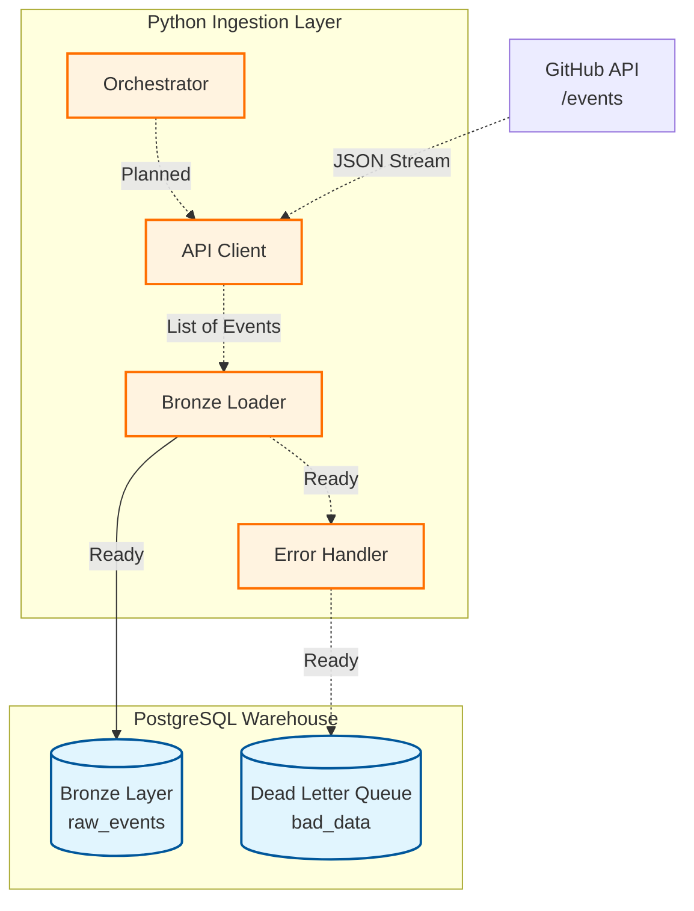

# GitHub Event Data Pipeline (Under Construction)

A robust, near real-time data pipeline being built to ingest high-volume public GitHub events into a PostgreSQL Data Warehouse.

Currently, the **Database Foundation** and **Project Infrastructure** have been established.

## 🏗 Planned Architecture

The pipeline uses a **Stateless Sliding Window** approach to ensure resilience and zero data loss.



## ✅ Current Progress

* [x] **Project Structure:** Organized folders for Ingestion (Python) and Warehouse (SQL).
* [x] **Infrastructure:**
* `config.py`: Secure environment variable management.
* `logger.py`: Centralized logging system.


* [x] **Database Setup:**
* `setup_db.py`: Automated script to initialize the database.
* **Bronze Layer:** `raw_events` table created with JSONB storage for flexibility.
* **Error Handling:** `dead_letter_queue` table created for failed records.


* [ ] **Ingestion Logic:** (Next Step) Building the API Client and Bronze Loader.
* [ ] **Transformation:** (Future) Silver and Gold layers.

## 🛠 Tech Stack (Current)

* **Language:** Python 3.10+
* **Database:** PostgreSQL 16
* **Libraries:**
* `psycopg2` (Database Interaction)
* `requests` (API Handling)
* `python-dotenv` (Security)


## 🚀 Setup & Run

### 1. Prerequisites

* Python 3.x installed.
* PostgreSQL installed and running.

### 2. Installation

```bash
# Clone the repo
git clone [https://github.com/yourusername/github-pipeline.git](https://github.com/yourusername/github-pipeline.git)

# Install dependencies
pip install -r requirements.txt

```

### 3. Configuration

Create a `.env` file in the root directory:

```ini
DB_HOST=localhost
DB_NAME=github_events
DB_USER=postgres
DB_PASS=your_password
GITHUB_TOKEN=your_optional_github_token

```

### 4. Initialize Database

Run the construction script to create Schemas and Tables:

```bash
python setup_db.py

```

*Output: `✅ Bronze Layer Created Successfully!*`

```
