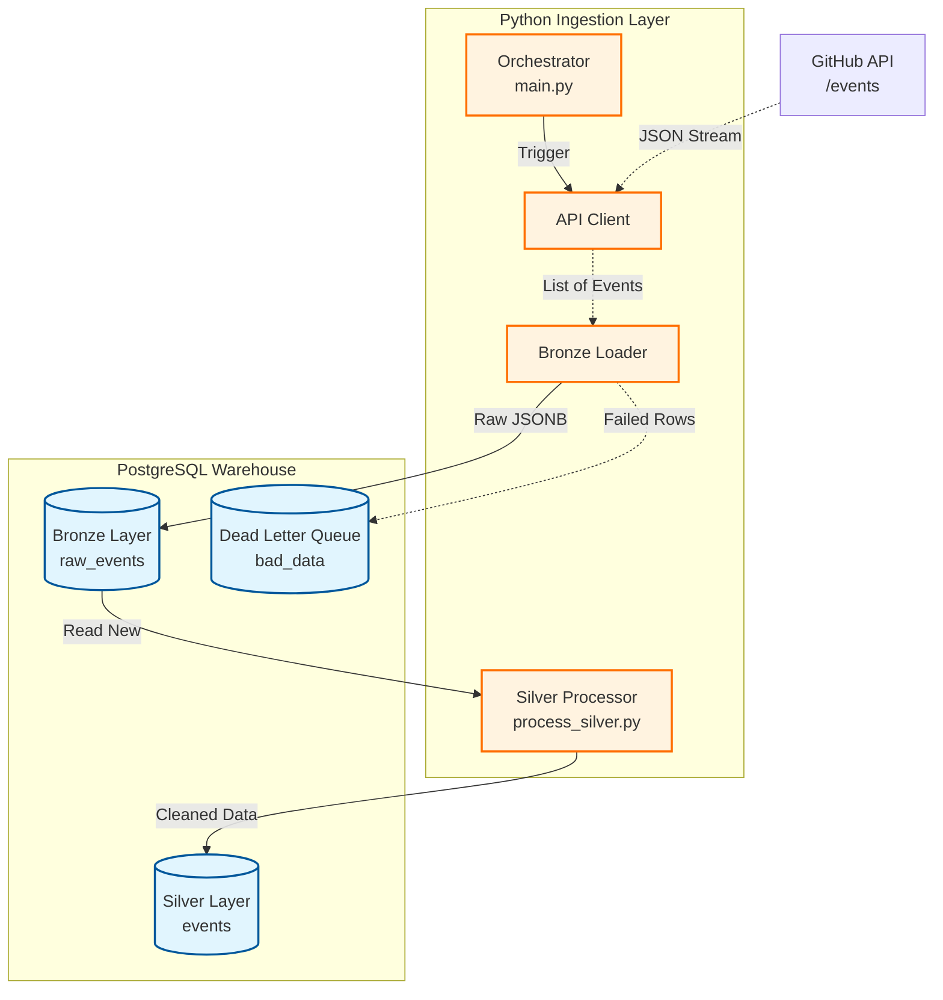

```markdown
# GitHub Event Data Pipeline 🚀

A robust, near real-time data pipeline that ingests high-volume public GitHub events into a PostgreSQL Data Warehouse using a **Medallion Architecture** (Bronze $\rightarrow$ Silver $\rightarrow$ Gold).

Currently, the **Ingestion Layer**, **Bronze Layer**, and **Silver Layer** are fully operational.

## 🏗 Architecture

The pipeline uses a **Stateless Sliding Window** for ingestion and an **Incremental Batch** strategy for transformation.



## ✅ Current Progress

### 1. Foundation & Infrastructure

* [x] **Project Structure:** Modular design (`ingestion/src`, `warehouse/sql`).
* [x] **Configuration:** Secure `.env` management via `config.py`.
* [x] **Observability:** Centralized `logger.py` with dual Console/File logging.

### 2. Ingestion Layer (Bronze)

* [x] **Database Setup:** Automated `setup_db.py` for Schema initialization.
* [x] **API Client:** Handles Rate Limiting (60 requests/hr vs 5000/hr) and Retries.
* [x] **Orchestrator:** `main.py` runs a continuous loop with drift correction and graceful shutdown.
* [x] **Raw Storage:** Data is stored as `JSONB` in `bronze.raw_events` to prevent data loss.

### 3. Transformation Layer (Silver)

* [x] **Hybrid Schema:** `silver.events` uses structured columns for filtering (`actor`, `repo`, `type`) + `JSONB` for rich details.
* [x] **Incremental Loading:** `process_silver.py` uses Anti-Join logic (`WHERE NOT EXISTS`) to process only new events.
* [x] **Performance:** Implements Batch Inserts (5000 rows/batch) and specialized Indexes (`GIN`, `BTREE`).

### 4. Analytics Layer (Gold)

* [ ] **Aggregations:** (Next Step) Building views for specific metrics (e.g., "Most Active Repos").

## 🛠 Tech Stack

* **Language:** Python 3.10+
* **Database:** PostgreSQL 16
* **Libraries:**
* `psycopg2` (High-performance DB Driver)
* `requests` (API Interaction)
* `python-dotenv` (Security)
* `mermaid.js` (Documentation)


## 🚀 Setup & Run

### 1. Prerequisites

* Python 3.x installed.
* PostgreSQL installed and running.

### 2. Installation

```bash
# Clone the repo
git clone [https://github.com/yourusername/github-pipeline.git](https://github.com/yourusername/github-pipeline.git)

# Install dependencies
pip install -r requirements.txt

```

### 3. Configuration

Create a `.env` file in the root directory:

```ini
DB_HOST=localhost
DB_NAME=github_events
DB_USER=postgres
DB_PASS=your_password
GITHUB_TOKEN=your_github_token  # Optional but recommended for higher limits

```

### 4. Initialize Database

Run the setup script to create Schemas (Bronze/Silver) and Tables:

```bash
python setup_db.py

```

*Output: `✅ Bronze Layer Created Successfully!*`

### 5. Run the Pipeline

**Terminal 1: Start Ingestion (Bronze)**

```bash
python ingestion/src/main.py

```

**Terminal 2: Run Transformation (Silver)**

```bash
python ingestion/src/process_silver.py

```

```

```
